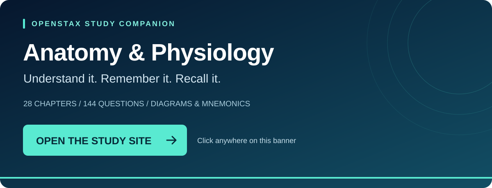

# 🧠 Anatomy & Physiology Notes

**An organized OpenStax study companion by RorriMaesu**

### [📖 Open the study site](https://rorrimaesu.github.io/Anatomy-Physiology-Notes/) · [⬇️ Download all files](https://github.com/RorriMaesu/Anatomy-Physiology-Notes/archive/refs/heads/main.zip)

---

## Start with the material you need

| Study resource | What you will find |
| :--- | :--- |
| [📚 Chapter notes](https://rorrimaesu.github.io/Anatomy-Physiology-Notes/#chapters) | 72 detailed sections in Chapters 1–12; 97 planning outlines in Chapters 13–28 |
| [🧩 Mnemonics](https://rorrimaesu.github.io/Anatomy-Physiology-Notes/03-Mnemonics/All-Memory-Cues.html) | Chapter memory cues, with precision notes to avoid misleading shortcuts |
| [✏️ Diagrams](https://rorrimaesu.github.io/Anatomy-Physiology-Notes/02-Diagrams/Diagram-Gallery.html) | Five original schematics, each with a labeled version and a numbered blank worksheet |
| [🎯 Retrieval practice](https://rorrimaesu.github.io/Anatomy-Physiology-Notes/04-Practice/All-Questions.html) | 144 original questions with [answers kept separately](https://rorrimaesu.github.io/Anatomy-Physiology-Notes/04-Practice/All-Answers.html) |
| [🔬 Lab references](https://rorrimaesu.github.io/Anatomy-Physiology-Notes/05-Lab-Reference/Lab-Reference-Sheets.html) | Histology, skeletal and muscle references, and comparison tables |
| [🗓️ Study plan](https://rorrimaesu.github.io/Anatomy-Physiology-Notes/00-Study-Plan/Study-Plan.html) | A practical routine for reading, drawing, recall, and revisiting mistakes |
| [📝 Templates](https://rorrimaesu.github.io/Anatomy-Physiology-Notes/#templates) | Reusable section notes, muscle and hormone records, error logs, and assignment tracking |

> **Know the scope:** “2e” means the **second edition** of the textbook, not Anatomy & Physiology II. The textbook spans a full A&P sequence. Chapters 1–12 are a provisional starting scope for these detailed notes, **not a verified A&P I syllabus**. Use your instructor’s chapter and lab lists to choose what to study.

## A study session that actually asks your brain to work

1. Read one assigned section and its notes.
2. Close the notes. Explain the process aloud or redraw it from memory.
3. Answer the practice questions before opening the answer key.
4. Record the mistake that fooled you and revisit it in a later session.

Recognizing a paragraph is easier than explaining it with the page closed. These files are organized to help with the second part.

## Use it offline, too

Download the repository ZIP, extract it, and open **index.html**. Keep the folders together so links and images work. HTML files are for reading and printing; Markdown (`.md`) copies are for editing. Diagrams include PNG and SVG versions.

## GitHub Pages setup

If the study-site link is not live yet, open [Settings → Pages](https://github.com/RorriMaesu/Anatomy-Physiology-Notes/settings/pages). Under **Build and deployment**, select **Deploy from a branch**, choose **main** and **/(root)**, then **Save**. GitHub will publish the existing `index.html`; no package installation or build command is needed. Later commits to `main` update the published site.

## Sources and reuse

Based on **J. Gordon Betts and colleagues, OpenStax Anatomy and Physiology 2e (2022)**. [Read the official textbook](https://openstax.org/details/books/anatomy-and-physiology-2e) and consult the [full source list](07-Sources/Sources-and-Attribution.md).

Adapted textbook material is shared under [CC BY-NC-SA 4.0](https://creativecommons.org/licenses/by-nc-sa/4.0/). These are independently prepared study notes, original practice questions, and study schematics; this project is not affiliated with or endorsed by OpenStax. See [attribution and license details](LICENSE.md).
